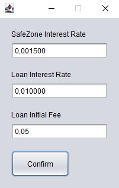

# Finances - An application that manages banking operations

## Overview
This is a desktop application built with **Java Swing** for managing finances.  
It connects to a **MySQL** database (via **XAMPP** or another MySQL server).  
All main operations — deposits, withdrawals, transfers, and loans — are handled directly through the graphical interface.

---

## Requirements
- **Java JDK 8+**
- **MySQL Server** (recommended: XAMPP)
- **MySQL Connector/J** file: `mysql-connector-j-9.4.0.jar`, Place the `.jar` file inside the `lib/` folder and make sure it’s included in your project’s classpath.).
Official download page: [https://dev.mysql.com/downloads/connector/j/](https://dev.mysql.com/downloads/connector/j/), choose Plataform Idependent
- (Optional) **NetBeans IDE** to run or edit the source code
---

## Install
- **Download and extract** the project into the folder C:\Users\User\Documents\NetBeansProjects\
- **Add connector library:**

- **Make sure you have the mysql server online**

- **Make sure the mysql server have the finances database**

- **Make sure the DataBase class have the correct address to conect in factory method**
---

## Project Structure
### Classes
- **Address**(zip_code, ...)
- **Contact**(name, ..., Address)
- **Client**(username, password, ..., Contact)
- **Admin**(...) extend Client
- Abstract **Capital**(balance, ..., Client)
- **Current**(...) extend Capital
- **SafeZone**(super(), Double interest_rate) extend Current
- **Loan**(..., Double initial_fee) extend SafeZone
- Abstract **Operation**(value, datetime, ..., Capital)
- **Deposit**(...) extend Operation
- **Withdraw**(...) extend Operation
- **Transfer**(..., Capital destination) extend Operation
### Forms

